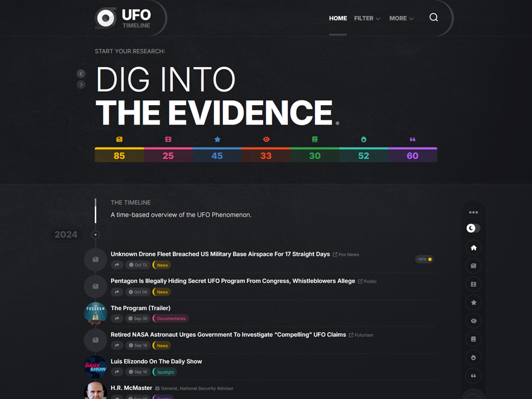

# UFO Timeline WordPress Website

## Theme Description

This is the complete UFO Timeline WordPress theme. This theme must use the same post categories and custom post types as the ufotimeline.com website to work. The code for this theme is **not built** to work with any other theme categories or post types. 

## Installation Steps

1. Install and activate the required plugins for this theme/website to work:
	- [WordPress Importer](https://wordpress.org/plugins/wordpress-importer/)
	- [Regenerate Thumbnails](https://wordpress.org/plugins/regenerate-thumbnails/)
	- [Meta Box](https://wordpress.org/plugins/meta-box/)
	- [Contact Form 7](https://wordpress.org/plugins/contact-form-7/)

2. Download the [ufotimeline.zip](https://github.com/AlxMedia/ufotimeline/archive/refs/heads/main.zip) from this GitHub repository and upload/activate the theme on your WordPress installation.

3. Download the latest theme data **XML** file:
	- [ufotimeline.WordPress.2024-11-23.xml](https://www.dropbox.com/scl/fi/4ap0kxp5ylhubeugme2ow/ufotimeline.WordPress.2024-11-23.xml?rlkey=h43qdtoh24gli0xuk90njs8qw&dl=1) (~2MB)
	- [media_library_export-ufo_timeline-2024_11_23.zip](https://www.dropbox.com/scl/fi/s38czsk2ciwoedw3be0ga/media_library_export-ufo_timeline-2024_11_23.zip?rlkey=j55r7wju8b0b90vwfsnegasko&dl=1) (~6MB - media library thumbnail images, these will be auto imported with the XML as long as my website stays up, so no need to download these)

4. In your /wp-admin/ admin panel, go to **Tools > Import > (WordPress) Run Importer**. Then select the theme data XML. Upload and import media.

5. Go to your website's homepage. Then press **Customize > Menus > View All Locations > Header > (Select) Main Menu** and save. You may need to edit the custom home link to work on your new site.

6. Go to /wp-admin/ and **Posts > Categories**. Press **Edit** on the X category. In the browser URL field you should now see an ID which you need to remember. In my case it is `&tag_ID=5`.

7. You now need to edit two theme files, **content.php** and **content-featured.php**. Locate the following code in them: `<?php exclude_post_categories('11'); ?>` and replace `11` with your ID found in step 6.

8. Go to /wp-admin/ and **Settings > Reading**. Set **Blog pages show at most** to **500** or more, and save.

9. Your ufotimeline clone website should now be complete!